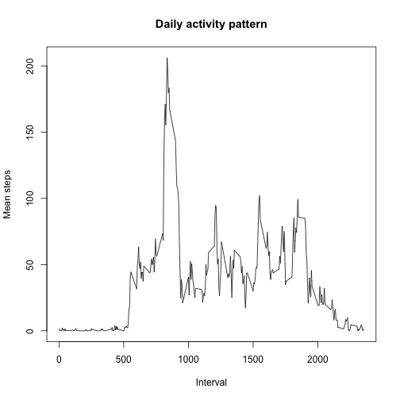

## Loading and preprocessing the data

```r
library(dplyr)
activity<-read.csv("activity.csv", header=TRUE, sep=",")
activity$date<-as.Date(activity$date, "%Y-%m-%d")
S<-summarise(group_by(activity, date), total_steps=sum(steps))
```
## What is the mean total number of steps taken per day?

```r
library(ggplot2)
ggplot(S, aes(total_steps))+geom_histogram(fill="blue")+
        xlab("Total steps")+
        ggtitle("Histogram of total steps taken per day")
```

 

Mean number of steps per day

```r
mean(S$total_steps, na.rm = T)
```

```
## [1] 10766.19
```
Median number of steps per day

```r
median(S$total_steps, na.rm = T)
```

```
## [1] 10765
```
## What is the average daily activity pattern?

```r
day_sum<-summarise(group_by(activity, interval), mean_steps=mean(steps, na.rm=T))

plot(day_sum$interval, day_sum$mean_steps, type="l", xlab="Interval", ylab="Mean steps", 
     main = paste("Daily activity pattern"))
```

 

Interval with maximum steps 


```r
filter(day_sum, mean_steps== max(day_sum$mean_steps)) 
```

```
## Source: local data frame [1 x 2]
## 
##   interval mean_steps
## 1      835   206.1698
```

## Imputing missing values

Total number of rows with NAs

```r
length(which(is.na(activity$steps))) 
```

```
## [1] 2304
```


### My stratagy is to fill NA with mean 5-minute interval value

```r
activity_filled<-inner_join(activity, day_sum, by="interval")
activity_filled<-mutate(activity_filled, steps=ifelse(is.na(steps), mean_steps, steps)) 
## new dataset with the missing data filled in 
```


```r
Sf<-summarise(group_by(activity_filled, date), total_steps=sum(steps))

ggplot(Sf, aes(total_steps))+
        geom_histogram(fill="red")+
        xlab("Total steps")+
        ggtitle("Histogram of total steps taken per day")
```

 

###New values compared with old ones

New values:
Mean

```r
mean(Sf$total_steps, na.rm = T)
```

```
## [1] 10766.19
```
Median

```r
median(Sf$total_steps, na.rm = T)
```

```
## [1] 10766.19
```

The old ones:
Mean

```r
mean(S$total_steps, na.rm = T)
```

```
## [1] 10766.19
```
Median

```r
median(S$total_steps, na.rm = T)
```

```
## [1] 10765
```
## Differences in activity patterns between weekdays and weekends

```r
activity_filled<-mutate(activity_filled, weekday=weekdays(date))
activity_filled<-mutate(activity_filled, weekpart=ifelse(weekday=="Sunday"|weekday=="Saturday", "weekend", "weekday"))
day_sum_f<-summarise(group_by(activity_filled, interval, weekpart), mean_steps=mean(steps, na.rm=T))
ggplot(day_sum_f,aes(x=interval,y=mean_steps))+
        geom_line(col= "blue")+
        facet_wrap(~weekpart)+
        scale_x_continuous(breaks = seq(0, 2400, by = 500))+
        ylab("Steps")+
        xlab("Interval")+
        ggtitle("Activity patterns between weekdays and weekends")
```

 

